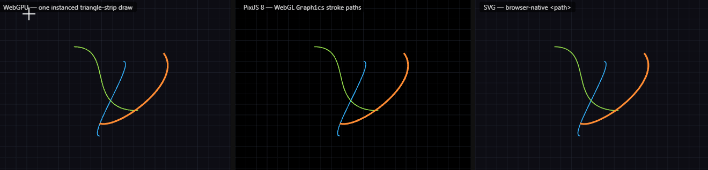

# @jsx6/line-render - 10KB minified / 4KB-gz

Rendering and hit-testing for cubic Bezier (`M x y C ...`) lines — the connector shape used by `apps/nodditor`.





It exists so a node editor can draw its connectors on a fast canvas layer
instead of (or in addition to) SVG:

- **world-unit stroke width by default** — a `width: 4` edge is 4 world units
  wide, so the rendered thickness scales with zoom; set `worldWidth: false` on
  an edge to keep the legacy zoom-independent, screen-pixel width instead;
- **batch rendering** — all edges in ONE instanced WebGPU draw call
  (one triangle strip per curve, sampled in the vertex shader);
- **fast hit detection** — a pure-JS screen-space picker that converts the
  click to world space and tests distance against a zoom-corrected threshold,
  so picking stays accurate while panning and zooming.

The pure functions work in Node and browser without WebGPU; a DOM/SVG editor
should adopt those first and treat `LineRenderer` as the optional canvas layer.
`LineRenderer` needs a WebGPU-capable browser (Chromium with WebGPU enabled).

## Edge data

One edge is one cubic Bezier segment in world coordinates — exactly the format
of an SVG `d` attribute `M x0 y0 C cx0 cy0 cx1 cy1 x1 y1`:

```js
const edge = {
  x0: 351.95, y0: 148.96,
  cx0: 411.95, cy0: 148.96,
  cx1: 179.95, cy1: 498.96,
  x1: 239.95, y1: 498.96,
  color: [0.2, 0.7, 1.0, 1.0], // RGBA, 0..1
  width: 4, // WORLD units by default (scales with zoom)
  worldWidth: false, // optional — omit for the default world-unit width
}
```

## API

- `parseLinePath(d, { color, width })` — SVG `M...C...` string → edge
- `edgeToPath(edge)` — edge → SVG `d` string
- `makeConnector(p1, p2, strength)` — the nodditor connector formula
  (horizontal tangents, strength clamped to half the point distance)
- `lineEdge(x0, y0, x1, y1, opts)` — a straight segment as a degenerate cubic
  Bezier (control points at 1/3 and 2/3 along the segment)
- `circleEdges(cx, cy, r, segments = 4, opts)` — a circle OUTLINE as
  `segments` cubic Bezier arcs (default 4)
- `polygonEdges(points, opts)` — a polygon OUTLINE as one degenerate cubic
  per side, closed by default (`close: false` for an open polyline)
- `sampleCubic(edge, t)` / `sampleTangent(edge, t)` — point / derivative at `t`
- `distToSegment(px, py, x0, y0, x1, y1)` — point-to-segment distance
- `edgeDistance(edge, x, y, samples = 24)` — point-to-curve distance (sampled)
- `pickEdge(edges, screenX, screenY, panX, panY, zoom, samples, radiusPx)` —
  the edge under a screen point, or `null`; the closest candidate wins. The
  per-edge pick radius is the LARGER of the edge's rendered half-width and
  `radiusPx` screen pixels: `radiusPx = 0` → exact (only on the stroke); any
  larger value adds a thickness-independent tolerance (easy picking of thin
  lines in a graph)
- `screenToWorld(...)` / `worldToScreen(...)` — viewport transforms
- `packEdges(edges)` — the 16-float-per-edge layout for the GPU buffer
- `LINE_SHADER` — the WGSL source
- `BLIT_SHADER` — the WGSL source for the linear-downscale blit
- `LineRenderer` — the WebGPU renderer (always 4x MSAA; supersampling is
  OPT-IN and costs `supersample^2` pixels):
  - `new LineRenderer(canvas, { segmentsPerCurve = 32, clear, supersample = 1 })`
  - `await renderer.init()`
  - `renderer.setViewport(panX, panY, zoom)` (or set `panX`/`panY`/`zoom` directly)
  - `renderer.setSupersample(n)` — opt into higher-quality antialiasing
    (render at `n`x resolution with 4x MSAA, linear-downscale); default 1
    keeps the plain 4x MSAA path
  - `renderer.render(edges)` — clears and draws all edges in one draw call
  - `renderer.dispose()`

The viewport convention is `screenPos = worldPos * zoom + pan`, the same
convention nodditor uses for its pan/zoom.

The canvas is **transparent**: the context is configured with
`alphaMode: 'premultiplied'` (the WebGPU default `opaque` would composite a
transparent clear as a black rectangle), so a `clear` of `[0, 0, 0, 0]` — or
any half-transparent color — lets the page background show through. Edge
colors are still passed as straight `RGBA 0..1`; the renderer premultiplies
them by alpha for compositing. The `clear` value goes straight to WebGPU and
is interpreted as premultiplied (identical for opaque, alpha-1 colors).

## Other shapes (lines, circles, polygons)

The renderer is a batch of cubic Bezier strokes, and every 2D outline is a
chain of such strokes — so straight lines, circle outlines and polygon
outlines need **no shader, buffer, or draw-call changes**; they are just
`Edge` lists from `src/shapes.js`:

- `lineEdge(x0, y0, x1, y1, opts)` — a straight segment as a *degenerate*
  cubic Bezier (control points at 1/3 and 2/3 of the segment). The strip
  becomes an exact rectangle and `pickEdge` reduces to an exact segment
  distance.
- `circleEdges(cx, cy, r, segments = 4, opts)` — a circle **outline** as
  `segments` cubic Bezier arcs with the standard Bezier-circle control offset
  `kappa = (4/3) * tan(pi / (2 * segments))` (0.55228475... for 4 arcs); a
  four-arc circle has a maximum radial error under one part in a thousand of
  the radius ([Wikipedia, "Bezier curve"](https://en.wikipedia.org/wiki/Bezier_curve)).
  Adjacent arcs share their endpoints **and** their tangents, so the triangle
  strips meet cleanly at the seams — no visible gap or overlap.
- `polygonEdges(points, opts)` — a polygon **outline** as one degenerate cubic
  per side, closed by default.

Corner caveat: each strip ends in a flat cap perpendicular to its own
tangent, so a polygon corner is a small notch rather than a miter or round
join. Invisible at connector-like widths; visible on wide strokes. Circle
outlines never show it (no corners). **Filled** shapes are not supported —
the pipeline is stroke-only; use SVG or PixiJS (see the migration section)
for fills.

## Why one instanced draw call — and what it constrains

Everything above renders through the same single `renderer.render(edges)`: one
flat `Float32Array` (16 floats per edge, 64-byte stride), one GPU buffer, and
one [`pass.draw(vertexCount, instanceCount)`](https://developer.mozilla.org/en-US/docs/Web/API/GPURenderPassEncoder/draw)
in which each instance reads its edge via `@builtin(instance_index)`
([spec: `GPURenderCommandsMixin.draw()`](https://www.w3.org/TR/webgpu/#dom-gpurendercommandsmixin-draw)).
That is the point of instancing: the per-shape variation (geometry, color,
width, `worldWidth`) is *data, not pipelines* — mixing straight lines,
beziers, circles and polygons costs zero extra draw calls, zero extra
pipelines, and zero extra bind groups.

The fixed 16-float stride is what makes this work: `packEdges` writes one
plain contiguous array and the WGSL `array<Edge>` has the exact matching
layout — the `vec2f` pairs at bytes 0..32, `color: vec4f` at 32..48,
`width`/`worldWidth`/pad at 48..64 ([WGSL memory layout](https://github.com/sotrh/learn-wgpu/blob/master/docs/showcase/alignment/README.md),
[WebGPU spec](https://www.w3.org/TR/webgpu/)). Adding a per-shape field
(e.g. a join type) would change the stride of *every* edge and re-couple
`packEdges` with the shader — the layout is deliberately minimal, which is
why the shapes are expressed in Bezier space on the CPU side instead of being
new GPU primitives.

What the single-pass design constrains (the "combining/ordering" problem):

- **Array order = z-order.** There is no depth test: edges blend in array
  order, so how the caller concatenates shape batches fixes the visual
  stacking. Reordering is cheap (array order only), but you cannot interleave
  per-shape draw calls or per-shape blend modes.
- **One `segmentsPerCurve` for the whole batch.** A straight line wastes
  samples on it and a large circle wants more — one uniform value serves all
  shapes in the batch (the default 32 is already sub-pixel for all of them).
- **One buffer, one `writeBuffer` per frame.** The whole scene is one
  contiguous upload; per-shape buffers would mean per-shape draw calls and
  per-frame buffer churn — exactly the cost the batch exists to avoid.

## Migrating to PixiJS 8


This library is a focused implementation for one use case — not a fence around
it. When a project grows past it (filters, blend modes, particles, text,
sprites, or a WebGL-instead-of-WebGPU stack), the path to
[PixiJS 8](https://pixijs.com/) is a 1:1 mapping, not a rewrite:

| line-render                                   | PixiJS 8                                                                |
| --------------------------------------------- | ----------------------------------------------------------------------- |
| edge `{ x0, y0, cx0, cy0, cx1, cy1, x1, y1 }` | `g.moveTo(x0, y0).bezierCurveTo(cx0, cy0, cx1, cy1, x1, y1).stroke()` — the final `.stroke()` commits the path; in PixiJS 8, `moveTo`/`bezierCurveTo` only *build* the path, and without `.stroke()` the `Graphics` draws nothing |
| `color: [r, g, b, a]` (0..1)                  | `color: toPixiColor(edge.color)` (0xRRGGBB) + `alpha: edge.color[3]`    |
| `width` in world units (default)              | stroke width in local units — PixiJS strokes scale with the container scale, so thickness grows with zoom, exactly like the WebGPU/SVG rendering |
| `worldWidth: false` (screen pixels)           | stroke width `edge.width / zoom` (PixiJS has no `non-scaling-stroke`)   |
| viewport `screen = world * zoom + pan`        | `layer.x = panX; layer.y = panY; layer.scale.set(zoom)`                 |
| `renderer.render(edges)`                      | `drawEdgesPixi(layer, edges, view, Graphics)` — one `Graphics` per edge |
| `pickEdge` / `edgeDistance` / `screenToWorld` | **unchanged** — they are pure functions of (edges, viewport), so hover/click behavior carries over with zero rework |

The bridge lives in `src/pixi.js` and is exported from the package root
(`toPixiColor`, `pixiStroke`, `drawEdgesPixi`). It has **no pixi.js import** —
the `Graphics` class is passed in by the caller — so the package stays
dependency-free and unit-testable; an app adds `pixi.js` itself only when it
actually migrates.

## Migrating to Two.js

[Two.js](https://github.com/jonobr1/two.js) is the **medium-size full-featured
2D direction**: a complete 2D scene graph (groups, shapes, animation, and
SVG / Canvas 2D / WebGL backends) at ~205 KB minified / ~50 KB gzip —
between this ~10 KB library and PixiJS 8's ~810 KB full dist. It is the right
choice when a project needs a real scene graph (transforms, animation, mixed
content) without the WebGL weight of PixiJS.

The edge model maps 1:1, the same way as PixiJS:

| line-render                                   | Two.js                                                                              |
| --------------------------------------------- | ----------------------------------------------------------------------------------- |
| edge `{ x0, y0, cx0, cy0, cx1, cy1, x1, y1 }` | `new Two.Path([a0, a1], false, false, true)` — closed `false`, curved `false`, manual `true` (**required**: without manual, Two's automatic `plot()` step rewrites every anchor command to a straight line and the edges collapse to chords) — with `a0 = new Two.Anchor(x0, y0, 0, 0, cx0 - x0, cy0 - y0)` and `a1 = new Two.Anchor(x1, y1, cx1 - x1, cy1 - y1, 0, 0, Two.Commands.curve)`; Two's anchors carry relative handles, and its SVG renderer emits exactly `M x0 y0 C cx0 cy0 cx1 cy1 x1 y1` |
| `color: [r, g, b, a]` (0..1)                  | `stroke: toTwoColor(edge.color)` (CSS `#RRGGBB`) + `opacity: edge.color[3]`, `fill: 'none'` |
| `width` in world units (default)              | `linewidth = edge.width` — the Group scale turns it into `width * zoom` screen px (Two's default stroke attenuation), exactly like the WebGPU/SVG rendering |
| `worldWidth: false` (screen pixels)           | `linewidth = edge.width`, `strokeAttenuation: false` — Two.js divides by the world scale internally; its native non-scaling stroke, no manual `÷ zoom` (unlike PixiJS) |
| viewport `screen = world * zoom + pan`        | `group.position.x = panX; group.position.y = panY; group.scale = zoom`             |
| `renderer.render(edges)`                      | `drawEdgesTwo(group, edges, view, Two)` — one `Two.Path` per edge, then `two.render()` (Two only repaints on demand when not playing) |
| `pickEdge` / `edgeDistance` / `screenToWorld` | **unchanged** — they are pure functions of (edges, viewport), so hover/click behavior carries over with zero rework |

The bridge lives in `src/two.js` and is exported from the package root
(`toTwoColor`, `twoStroke`, `edgeAnchors`, `drawEdgesTwo`). It has **no
two.js import** — the `Two` namespace is passed in by the caller — so the
package stays dependency-free and unit-testable; an app adds `two.js` itself
only when it actually migrates.

npm naming gotcha: the real package is **`two.js`** (jonobr1). The bare `two`
on npm is an unrelated package — install `two.js`, or load
`https://cdn.jsdelivr.net/npm/two.js@0.8.24/build/two.min.js` (UMD, global
`Two`) / `.../build/two.module.js` (ESM default export).

A complete, runnable side-by-side — WebGPU, Two.js, PixiJS 8, and native SVG
drawing the same edges, the same grid, under one shared pan/zoom and one
shared picker — is in `docs/compare.html`.

| Build                                                                                          | Minified                | Min + gzip            |
| ---------------------------------------------------------------------------------------------- | ----------------------: | --------------------: |
| **line-render** (whole package, bundled)                                                       | **10.4 KB**             | **4.0 KB**            |
| PixiJS 8.21.0 full dist — the `dist/pixi.min.mjs` the compare page actually loads from the CDN | 810 KB                  | 229 KB                |
| **Aggressive deep imports** — `Application`, `Container`, `Graphics` (3 the compare page uses) | 421 KB                  | 123 KB                |
| Two.js 0.8.24 — `build/two.min.js` from the npm tarball                                        | 205 KB                  | 50 KB                 |

**Bottom line:** the bundle-size spectrum runs **line-render (10.4 KB min /
4.0 KB gz) < Two.js (205 KB min / 50 KB gz) < PixiJS 8 (810 KB full / 421 KB
deep-import min; ~123 KB gz for the three classes the compare page uses)**.
Two.js is the medium-size full-featured 2D direction — a real scene graph with
SVG/Canvas/WebGL backends and a native non-scaling stroke — at ~20× line-render
and ~4× smaller than PixiJS 8 at its leanest. Raw connector drawing stays on
the 10 KB lib; a full-featured 2D scene without WebGL weight goes to Two.js;
a WebGL scene with filters, particles, and text goes to PixiJS.


## Demo

Serve the PACKAGE ROOT (not `docs/`), because the demo pages import `../index.js`,
which only resolves when the server root is the package directory:

```
bun x live-server libs/line-render
```

then open in a WebGPU-capable browser:

- `http://127.0.0.1:4000/docs/index.html` — the WebGPU canvas alone: wheel = zoom
  at the cursor, drag = pan, hover = highlight, click = pick.
- `http://127.0.0.1:4000/docs/compare.html` — side-by-side verification: the
  WebGPU canvas, a Two.js SVG, a PixiJS 8 canvas, and a native SVG rendering of
  the exact same edges and grid under one shared pan/zoom and one shared
  picker. If the implementations are correct, the four panels overlap pixel for
  pixel at any zoom. Checkboxes: "supersampling ×2" opts into the
  higher-quality antialiasing path (the plain 4x MSAA path is the default);
  "lines scale with zoom" and "grid scales with zoom" (both on by default)
  switch the stroke width between world units (scales with zoom) and
  zoom-independent screen pixels — the SVG panel mirrors the switch with
  `vector-effect="non-scaling-stroke"`, the Two.js panel with its native
  `strokeAttenuation: false`, and the PixiJS panel keeps the same world-unit /
  `width / zoom` semantics from `src/pixi.js`.

## Notes

- The canvas is used 1:1: `canvas.width`/`canvas.height` (backing-store pixels)
  is both the draw surface and the coordinate space for hit testing. Do not
  CSS-scale the canvas, or account for the scale yourself.
- `pickEdge` is the closest-candidate picker: when two edges are both within
  the threshold, the nearer one wins (a deliberate upgrade over a first-match
  `find`).
- GPU buffers are created once and grown as the batch grows; a frame costs two
  `writeBuffer` calls and no buffer allocation.
- **Background / alpha caveat:** a WebGPU canvas defaults to `opaque` — with
  that setting a transparent `clear` still renders as a black rectangle,
  because the browser composites every pixel as alpha 1. `LineRenderer`
  therefore requests `alphaMode: 'premultiplied'`: a `clear` of
  `[0, 0, 0, 0]` (or any half-transparent color) lets the page background
  show through, while the default `clear` `[0.05, 0.05, 0.08, 1]` is opaque
  and paints a dark background. Every color written to the canvas — fragment
  output and `clearValue` — is premultiplied by its own alpha; edge colors
  are still passed to the API as straight `RGBA 0..1`.
  See `docs/webgpu-pitfalls.md`, entry 13.
- `docs/webgpu-pitfalls.md` — the MSAA/supersampling caveats and every
  initialization error hit along the way (uniform fetch layout, MSAA resolve
  direction, WGSL builtin names, required `layout`, `TEXTURE_BINDING`, ...).
